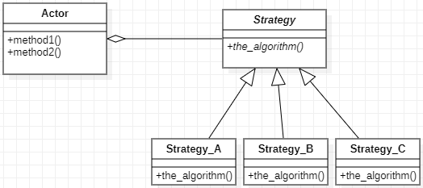
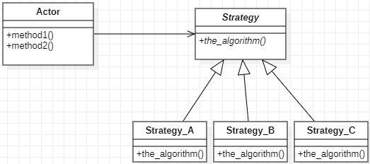

# Πρότυπο Σχεδίασης: Strategy

- Το συγκεκριμένο πρότυπο ορίζει μια ομάδα/οικογένεια αλγορίθμων που αποτελούν εναλλακτικές επιλογές ο ένας του άλλου.
- Χρησιμοποιείται όταν κάποια συγκεκριμένη μέθοδος/αλγόριθμος προβλέπεται να έχει διάφορες υλοποιήσεις.

## Γενική περιγραφή Strategy
Η γενική αρχή της σχεδίασης θα μπορούσε να αποτυπωθεί ως εξής:

**Εναλλακτικά:**

## Παράδειγμα

- [ ] [Μεταφραστής](./example_translator) (Strategy version)

### Ενδεικτικές πηγές για περαιτέρω μελέτη:
- [ ] [Automated refactoring to the Strategy design pattern](https://www2.aueb.gr/users/bzafiris/docs/cgzs12.pdf)
- [X] [Design patterns: elements of reusable object-oriented software](http://faculty.chas.uni.edu/~wallingf/teaching/062/sessions/support/pattern-examples.pdf)
- [ ] [Evaluation of design pattern alternatives in Java](https://onlinelibrary.wiley.com/doi/pdf/10.1002/spe.3061)
- [ ] [Class Diagram - StarUML documentation](https://docs.staruml.io/working-with-uml-diagrams/class-diagram)
